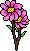

### My first 2D RPG project in [Godot](https://godotengine.org/) 

-----------------------------------------------------------------------------------------------------------------------

#### Ressource du jeux, pour ce que nous avons prendre en ligne:

### 1) <ins>*[**Viet NGUYEN**](https://github.com/Viet281101) / L1-C / 20006303 :*</ins>

- Pixel Font:
[_Peepo Regular font_](https://www.urbanfonts.com/fonts/Peepo_Regular.font) et
[_mincraftia font_](https://www.dafont.com/minecraftia.font)

- En [_pixilart.com_](https://www.pixilart.com/), j'ai pris 
[_magic circle blue_](https://www.pixilart.com/art/magic-circle-c2b40ee745b9816)

- Les ennemis dans le jeu sont dessinés en fonction des références des mob dans les jeux Space Invaders que j'ai déjà vu en ligne.
Avec chaque niveau est différent avec des couleurs différentes, 
mais je l'ai choisi pour la simplicité du dessin et c'est très sympa pour moi.
[_enemy style_](https://www.dreamstime.com/video-game-bit-space-aliens-spaceship-pixel-art-video-game-bit-space-aliens-spaceship-pixel-art-embroidery-flowers-elements-image105139418)

- En [_OpenGameArt.org_](https://opengameart.org/), j'ai pris 
[_wooden house_](https://opengameart.org/content/wooden-house-with-animated-door-pixel-art)
et le pont que j'ai dessiné est une référence à ce modèle du pont même si je ne l'ai pas très bien dessiné:
[_wooden bridge_](https://opengameart.org/content/lpc-wooden-bridge-rework)

- Le clift tileset , j'ai pris ici: 
[_clift tileset_](https://github.com/uheartbeast/youtube-tutorials/blob/master/Action%20RPG/Action%20RPG%20Resources.zip)
c'est un tuto en ligne avec des ressources ouvertes associées.

- Et tout le reste comme les arbres, les armes, les personnages, l'eau, l'herbe, les fleurs, ... sont entièrement dessinés à la main par nos soins sur [libresprite](https://libresprite.github.io/#!/).

En cours de route, nous avons regardé des tutoriels de dessin sur youtube, et cela a plutôt bien fonctionné pour nous.
Si vous avez besoin d'un lien vers les tutoriels que nous avons regardés pour créer les images de ce projet. 

N'hésitez pas à nous demander.
Mais la plupart des instructions sont en anglais.

----------------------------------------------------------------------------------------------------------------------------

### 2) <ins>*[**EBOUREFE ELIE**](https://github.com/Opus404) / L1-C / 21001586 :*</ins>

- En pixel art, j’ai pu réaliser les explosions ( notamment des 
boules de feu), j’ai regardé quelques tutoriels anglais qui m’ont 
fortement aidé surtout sur les choix des couleurs et de l’animation 
et c’est pour cela que nous avons donc réussi à créer une explosion 
à l’image de notre jeux 

- Meme si ca n’a pas été très concluant, j’ai aussi essayé de faire 
en pixel art des lucioles coloré à l’aide de mon imagination, mais 
le problème étant que la couleur de fond devait être transparent sur 
[libresprite](https://libresprite.github.io/#!/) et j’ai peiné à la trouver

- J’ai pu trouver un son de rivière sur [_OpenGameArt.org_](https://opengameart.org/), étant libre de 
droit et très bien réalisé, je me suis dis que ce ne serait pas mal 
de l’avoir 
[_water fall sound_](https://opengameart.org/content/water-flowing-sound)

- Pour les bruits de pas aussi je me suis permis de prendre un son 
libre de droit qui est le suivant : 
[_walk step sound_](https://opengameart.org/content/rock-walk-step-sound-yo-frankie)

- Pour le son d’ambiance en background, il a été fait via [_beepbox_](https://www.beepbox.co/#9n31s0k0l00e03t2ma7g0fj07r1i0o432T1v1u65f0q0x10t51d08A1F2B9Q00d0Pfc47E3b662878T1v1uabf0qo1411d23AcF4B5Q2600Pdc00E21174T5v1u43f0qwx10n511d03HT_QT_ItRAJJAAzh0E1b7T4v1uf0f0q011z6666ji8k8k3jSBKSJJAArriiiiii07JCABrzrrrrrrr00YrkqHrsrrrrjr005zrAqzrjzrrqr1jRjrqGGrrzsrsA099ijrABJJJIAzrrtirqrqjqixzsrAjrqjiqaqqysttAJqjikikrizrHtBJJAzArzrIsRCITKSS099ijrAJS____Qg99habbCAYrDzh00E0b4h400000000h4g000000014h000000004h400000000p16000000) et 
c’est le suivant:
[_main theme_](https://www.beepbox.co/#9n31s0k0l00e04t2ma7g0fj07r1i0o432T3v1ud9f0q0x10l51d03SM005050wwpbaaihE1b2T1v1uadf0q0z10o531d03A1F0B2Q31bdPb525E2b263bT1v1u97f0q0z10t231d4aA9F3B6Q5428Paa74E3ba63975T4v1uf0f0q011z6666ji8k8k3jSBKSJJAArriiiiii07JCABrzrrrrrrr00YrkqHrsrrrrjr005zrAqzrjzrrqr1jRjrqGGrrzsrsA099ijrABJJJIAzrrtirqrqjqixzsrAjrqjiqaqqysttAJqjikikrizrHtBJJAzArzrIsRCITKSS099ijrAJS____Qg99habbCAYrDzh00E0b4h4w0000000h4h000000014h800000004h4w0000000p225FEYFjePhIyqfk8Y1pieNFNtPhWb6aCzQCqfoiAzJPewFBR6nluhR5Zhu18QQuiArd7IfUMAutV7kzx79SpoCpDuhw9TWqf9rHmqfrOczML0idd6shQTBXd6nVuCzf8YgMOM0)
et pour l'intro du jeux:
[_intro theme_](https://www.beepbox.co/#9n62sbk5l04e0gt22a7g0kj0_r3i111111111o432551T0v0u00f0qU11211d04w1h6E0T0v0u00f0qU11211d04w1h6E0T0v0u00f0qU11211d04w3h6E0T0v0u00f0qU11211d04w3h6E0T0v1u00f10l0qM1131d04w1h2E0T0v1u00f10l0qM1131d04w1h2E0T0v0u00f0qU11211d04w5h3E0T1v0u01f0qU11311d04A0F0B0Q0000Pff00E0T0v1u00f0qU11211d04w5h3E0T0v2u00f0qU11211d04w1h0E0T1v0u01f0qM1131d04A0F0B0Q0000Pb000E301602612T1v0u01f0qM1131d04A0F0B0Q0000Pb000E301602612T2v1u02f0qw02d03w1E0T2v1u02f0qw02d03w1E0T2v2u02f0qw02d03w1E0T2v2u02f0qw02d03w1E0b00000613wwwkc84wM8skb63hM00321gMs8112hgI223x1wQsg0wwog221x0886430ggc8110Mw44320ggc8531N0Ak0001oMqe2y18E221yxoMqe7A298Elb5P000000ggc8110Mwc221x0886400004210ww842110000410wgg00000M84230wg84610wgo421p2q5kR-hARfsyCO_4R_dtqqfGBbQRb5arwSQRbipm4Qrs3t19vKn9IJVjHJ7hBd7RkCLWiZdiTmCOSKrDCGKqi-ljhMezVtGrnUkWVuejhIQRFuCFgF7NLNOv2GL6BdQ_3yHU4FU1rOqByhWikWWDj1jnYFEZahN5jqZxdvtOHOq-VjH5KBjbBEjnQFH_Bd7ByhjkWAyCUeijkQFBqjhEc2CzwU5jsvJ1dvG9EY9dBZo98RRKy5eKnOkQvarnQkRfiDnh-SCzXWTuFFGvaTw6CRYqhs2llinBBe9VQzB00000000000000000G32D6s5eKQsiASLOFKDQyrnNleKFURdvwG3F-no8fobS4kSLZv1RYm9O82CLMGmj9Gv95dBWiq_S2AkQvlbUWX11YwntumWFKfVattjFmCR-AR-3iFKfNiq_hGIjh_Oe8KUWiTHuJJu4DdZoCUfX9Ft5atsKzaqfBdHGGqDFjHEZaQQuzrsCLVkT7WrNFdHZmzDbGGX96WA0000000000000001r0LD0rGL7Ng9qjQ6HggwC08fb9Wfgg5EcaspFzCDnqfKWPnUh0CLWmjFXccCLlX9vnsye00000000000000000009uFEd0QCFkkQttaqcELSV7fSsBbZKNd6XjIB-akstKTl9vPTfstjNhvGAzPaqZNb-HUPGGuGbZFcH7tQZQFHVlPOqAZdByiq-BduTmCzGjhIGDwNvsjhYFH-ASLpuFROYuCnAmAld7wGCnqb9jHBww4QqwCLtjqXyqZGJwiqByBdBLrBGqdiAkR-yGttNb4BeKFgskOWBOxjbBrAQRXGCWtAteEH_yqe3jhyaq-FdutNWrwWAQrdaCLgm1n9JtFdiRkCzqHIFGiZduRBnpCkCOTlemwwg5cmwIkNqOJlVsFji1hn5yBdiq_Vdvtv9aZtd2kMlcKFq00000000000000001bRd1E6ARayCzHFjhB5-T8V-PAFvJS9ETqtALNizzJSWFb-uVXzGuabZkAupjnK9vRv6tljRhvKFBoX1wbrkLWTyuGFWALTp74JDa5dQ_1jHJ710jh_kFH_ALjkLRFESGkQphvyJ2qeXkUaBbRd1E74RbGqeWBd6inXYyCzpjnLFvRL6ZrjRhvJ9BoXODKCl9Gvp5dBWiq_CKJd7RiGu35ZNd7OCLWjtfoFRO_-CnAmAld7wGCnqb9jHBww4QqwCLtjqXyqZGJwiqByBdBLrBGqdiAkR-yGttNb4BeKFgskOWBOxjbBrAQR_GCWtAElmyRqaeN97kALGQR_Vdj_oCO-QR_dtqqfGDjtfMkWXhMgkQu9jU0FuCFmihjs6F9GmAOI9EQ61wEbjh_F5djGlFK3IjkQFBqjhEc2CzwU5hn-cZd689HWARUDM5URTdaCLgm1n9JtFdiRkCzqHIFGiZduRBnpCkCOTlemwwg5cmwIkNqORlVsFji1Fn5yBdiq_Jdvtv9aZtd2kMkR_g0000000000000Gufh-ijsuhAPAe5HmOcCsxMJqChAPAe5DIz9D8kfE_Qw0000000000000000000lciIe8bQ5j4Jgxj4H2tDotBIX6PIV2e_Ac000000000000000000004LkNaM2bW2-wLE5jaKx85WC9m45Z000000000000000000000)

- Enfin, pour les sons comme le power up, les portails, les 
attaques, les arbres qui se cassent etc… ils ont été fait sur [_rfxgen_](https://raylibtech.itch.io/rfxgen)

